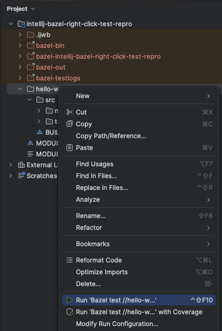
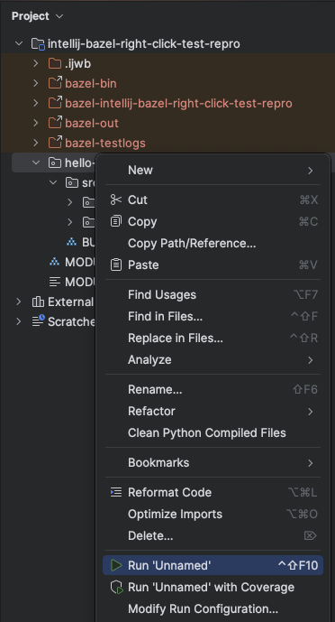
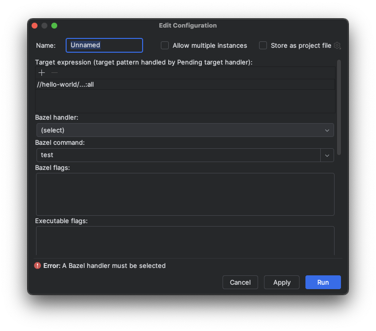

1. Open IntelliJ 2024.3.5
2. `Import Bazel Project`, choose this project, use defaults
3. Wait for sync to finish
4. Right-click `hello-world` folder
5. Try to use generated Run Configuration

It used to work with Bazel for IntelliJ version `2025.02.04.0.1-api-version-243`

Now it is failing with Bazel for IntelliJ `2025.04.01.0.1-api-version-243`

When selected, it now asks the user to "fill out" the Run Configuration, which is confusing

